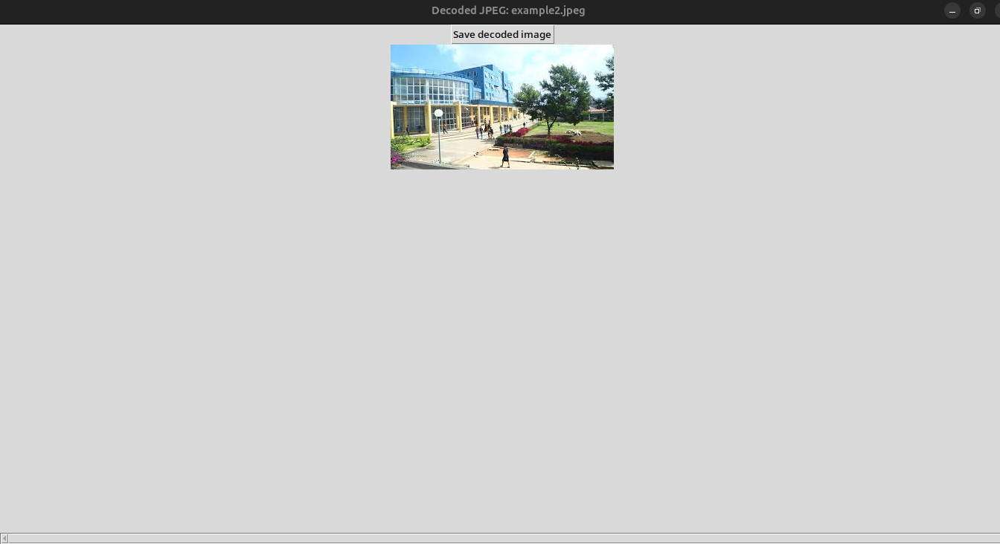

# PyJpegDecoder

PyJpegDecoder is a Python application designed to decode and render JPEG images without relying on external image processing libraries. It provides a practical demonstration of low-level JPEG decoding, including header parsing, Huffman decoding, quantization, and color space conversion.

## Features

- Decodes JPEG images from scratch
- Parses JPEG headers, quantization, and Huffman tables
- Converts YCbCr to RGB color space
- Renders and saves the decoded image as PNG
- Interactive file selection via a graphical interface

## Project Structure

```
PyJpegDecoder/
├── jpeg_decoder.py         # Main decoder script
├── jpeg_decoder_ui.py      # (Optional) GUI version
├── requirements.txt        # Python dependencies
├── image.png               # UI screenshot (optional)
└── README.md               # Project documentation
```

## Installation

> **Note:** Python 3.10 or higher is required.

1. Clone the repository:

   ```bash
   git clone https://github.com/your-username/PyJpegDecoder.git
   cd PyJpegDecoder
   ```

2. Create and activate a virtual environment:

   ```bash
   python3 -m venv venv
   source venv/bin/activate  # On Windows: venv\Scripts\activate
   ```

3. Install the required dependencies:
   ```bash
   pip install -r requirements.txt
   ```

## Usage

1. Activate the virtual environment:

   ```bash
   source venv/bin/activate
   ```

2. Run the decoder:

   ```bash
   python3 jpeg_decoder.py
   ```

3. A file dialog will appear – select a `.jpeg` image.

4. The decoder will:

   - Read and parse the JPEG headers
   - Display scan mode, dimensions, and Huffman tables
   - Decode Minimum Coded Units (MCUs)
   - Convert from YCbCr to RGB
   - Render and **save the decoded image** in a specified folder

📸 Example:

```
Please choose a JPEG image...
Reading file 'example2.jpeg' (12,481 bytes)
Parsed quantization table - ID: 0
...
Progress: 209/209 (100%) DONE!
Converting colors from YCbCr to RGB...
Rendering the decoded image...
Decoded image was saved to '/path/to/your/image/example2png (1).png'
Program finished. Have a nice day!
```



> ✅ The decoded image will be saved automatically in the target folder.

## 🤝 Contributing

Contributions are welcome! Feel free to submit a pull request or open an issue for bugs and improvements.

## 📧 Contact

**Mekin Jemal**
📫 [mekinjemal999@gmail.com](mailto:mekinjemal999@gmail.com)
🔗 [LinkedIn](https://linkedin.com/in/mekinjemal)

## 📄 License

This project is licensed under the MIT License.

```

---

Let me know if you'd like me to:
- Include `requirements.txt` content
- Add badges (e.g. Python version, license)
- Insert a link to your GitHub repo

Would you like me to save or generate this `README.md` file for you?
```
